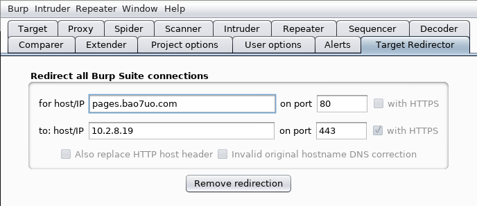
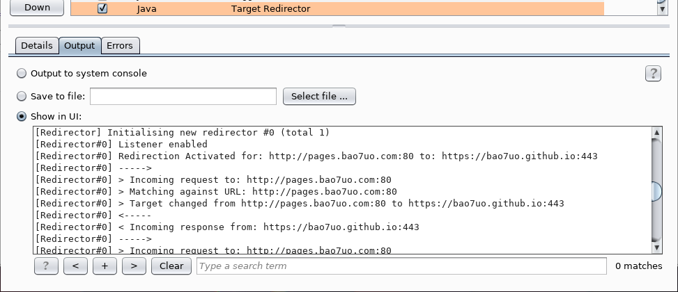
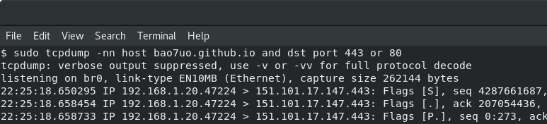

# Target Redirector - A Burp Suite Extension

#### Redirects requests from ALL Burp areas, not just the proxy

Target Redirector is a Burp Suite Extension written in Kotlin, which redirects all Burp requests destined for a chosen target to a different target of your choice. The hostname/IP, port and protocol (HTTP/HTTPS) can all be configured to an alternative destination. You can choose to leave the HTTP Host header intact or update it if necessary. Other HTTP headers and the body remain unaffected.

> "the Redirector will save a bit of messing with routing and iptables"
> -- *[@ticarpi](https://github.com/ticarpi)*

## Overview

This plugin is useful in various situations where you want to force a particular target hostname/IP and/or port and/or protocol to be used. Features include:

- redirect all (or specific) http connections to https or vice-versa
- redirect connections destined for any (or specific) host and/or port to a different host and/or port
- alter host header

Examples of use:

- testing a staging/pre-production environment on a different host and/or port which insists on linking/redirecting you back to the production environment. you can add both environments to scope, and allow the scanner to scan all the referenced pages, but whilst ensuring that only the staging/pre-production targets are scanned
- testing a web application which is protected by third-party DDOS protection/load balancers that present on the public URL. The third-party servers are not in scope so cannot be tested. A backend target IP/hostname has been provided, but the public URL is referenced all over the target web application
- hostname resolving to multiple IP addresses, but you can only test one IP, and you do not want to the "fix" DNS using hosts file or similar
- testing the unencrypted version of a site which is hosted as both TLS/SSL and unencrypted, but the unencrypted site links you back to the SSL one
- as above, but the other way round. strangely enough I have encountered many web apps which like to downgrade from TLS/SSL to unencrypted

## Build / Requirements

This project is written in Kotlin, although is currently built with the regular Java Burp API. Building from source requires the Kotlin compiler (tested with kotlinc-jvm 1.2.10).

To build, use the following command which has been tested successfully on both Windows and Linux.

- `kotlinc -classpath burp-extender-api-1.7.22.jar src/main/kotlin/target-redirector.kt -include-runtime -d target-redirector.jar`

The project can be built against a Kotlin version of the Burp API. See the following page from my other repo which has further details about the Burp API and Kotlin.

- https://github.com/bao7uo/burp-extender-api-kotlin/blob/master/README.md

To build with the Kotlin Burp API, place the API kt source files in the `src/main/kotlin/burp directory` and build with the following command.

- `kotlinc src/main/kotlin/burp/*.kt src/main/kotlin/target-redirector.kt -include-runtime -d target-redirector.jar`

## Usage

This extension is simple and intuitive. It will search ALL requests made by Burp or proxied by Burp for the hostname/port/protocol combination specified in the upper row. If all three connection detail criteria match for a request, the extension will replace the connection criteria with those specified in the lower row. Status updates are logged in the extension's stdout on Burp's Extender tab.

#### Demo

To test the extension, set the upper row hostname to pages.bao7uo.com with port 80 and HTTPS unticked. Set the lower row hostname to bao7uo.github.io with port 443 and HTTPS ticked. Leave the hostname option unticked, and click on the button to Activate redirection.

Then Proxy a browser through Burp to page http://pages.bao7uo.com/target-redirector_test.html

A check of the log in Burp extender's stdout for Target Redirector should show that the redirections are taking place, as shown in the screenshot below.

A packet capture will confirm this is the case.

## Target Redirector Roadmap

This project is still under development.

#### Potential future improvements:
- Improve UI
- Source code optimisation

#### Potential future features:
- [x] <s>Hostname resolution for invalid hostnames</s>
- [x] <s>Replacing port as well as hostname</s>
- [x] <s>Default host header</s>
- [x] <s>Custom host headers</s>
- [x] <s>Regex matching for host/port</s>
- [x] <s>Case insensitivity of hostname</s>
- [x] Flexible HTTP/HTTPS options
- [x] Allow redirecting of any host/port
- [x] Allow destination host or port to remain unchanged
- [ ] Comment/highlight redirected requests 
- [ ] Multiple search terms/redirections
- [ ] Save settings
- [ ] Session handling actions / Burp tool scope
- [ ] History, monitoring, logging

## Contribute
Contributions, feedback and ideas will be appreciated.

## License notice

Copyright (C) 2016-2018 Paul Taylor

See LICENSE file for details.
